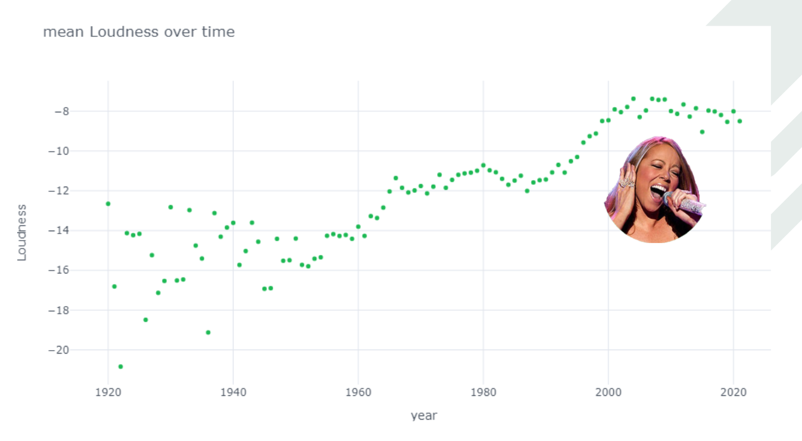
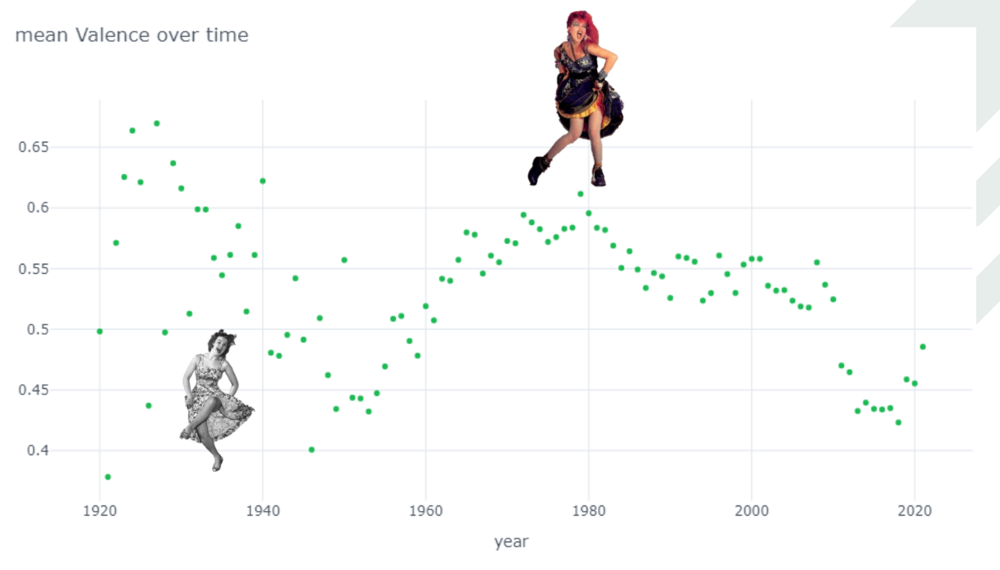
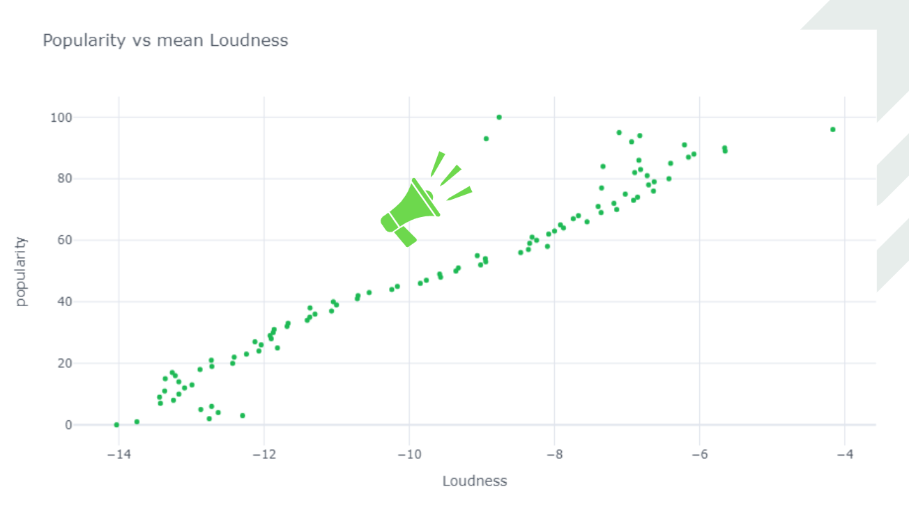
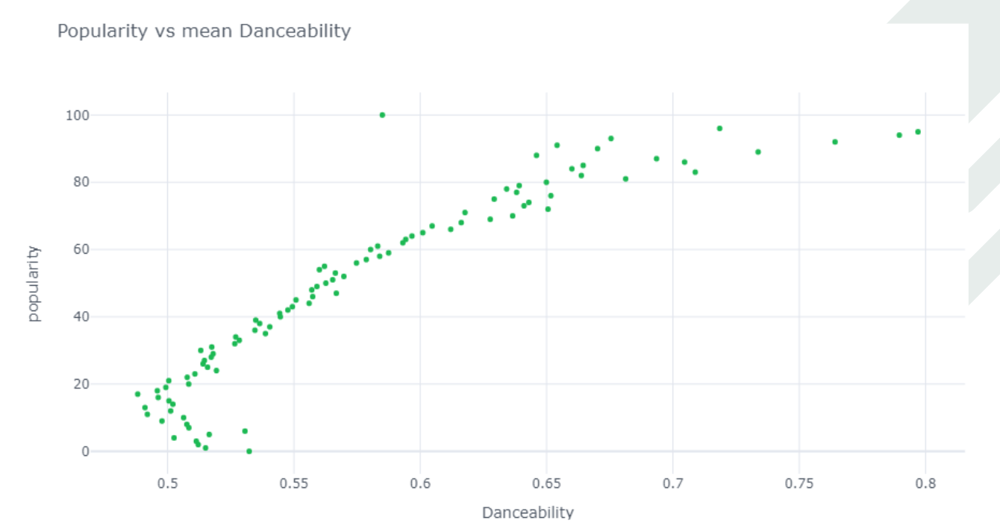
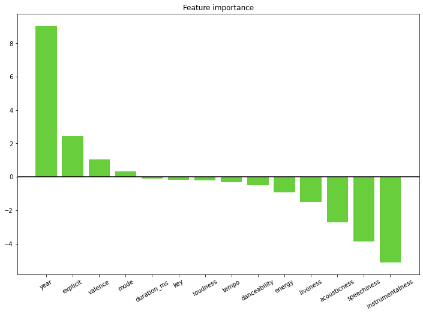
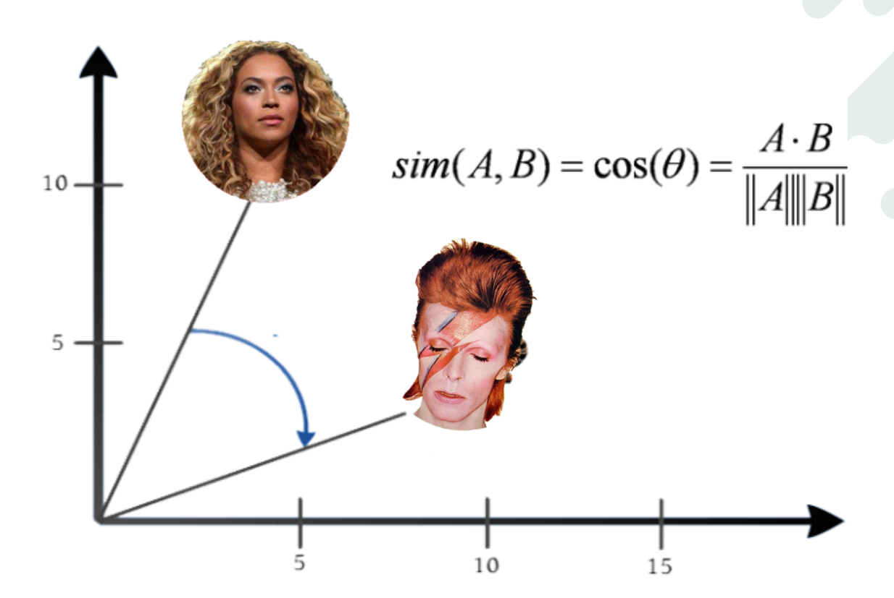

# The data behind Spotify music

[Spotify](https://www.spotify.com/) is an audio streaming service with more than **70 million tracks** and with over **356 million active users** every month. With these numbers, Data Analysis is a must! The Spotify databases are enriched with lots of features: *popularity*, *danceability*, *key*... You can see them for yourself in [its API](https://developer.spotify.com/documentation/web-api/).

For my analysis, I used [this dataset](https://www.kaggle.com/yamaerenay/spotify-dataset-19212020-160k-tracks) collected with this API by a Kaggle user, [Yamac Eren Ay](https://www.kaggle.com/yamaerenay). There are two main datasets: one for **songs** and another one for **artists** (the other datasets are derived from the first ones, by aggregation techniques). The songs dataset contains around **600k songs**, released between **1922 and 2020**.

## 1. Analysis

### How has music taste changed over time?

First, I wanted to see how the Spotify features have changed over the years. To do that, I aggregated the songs **by year** and took the **mean or the mode** of each feature (see the code in [Spotify_analysis.ipynb](https://github.com/AntoniaVillarino/spotify/blob/main/Spotify_analysis.ipynb), or in this [nbviewer link](https://hub.gke2.mybinder.org/user/antoniavillarino-spotify-s2k4izym/notebooks/Spotify_analysis.ipynb) to see the **interactive** plots)

These are some of the resulting plots:

The songs are becoming:

- **longer**
- **louder**
- and with **faster** tempos

The *valence* of the songs (positiveness, see the [Spotify API](https://developer.spotify.com/documentation/web-api/reference/#object-audiofeaturesobject)):

- had more variance **before the ’50s**
- peaked in the **’80s**
- went **down** until recent years

### What makes a song popular?

When making the previous time series analysis, I found a surprising fact: the mean ***popularity*, grows over time**. In other words, more recent songs are more popular. How can that be? My intuition is that there are lots of old, popular songs... How is Spotify **defining "*popularity*"**?

[Checking in its API](https://developer.spotify.com/documentation/web-api/reference/#object-trackobject), we find that popularity is based on the total number of plays the song has, and **how recent** those plays are. So, songs that are being **played a lot now are more popular** than songs that were played a lot in the past. 

With this in mind, I aggregated the songs dataset **by popularity**, and made bivariate plots to see how the other features were related to it (you can also see the code in [Spotify_analysis.ipynb](https://github.com/AntoniaVillarino/spotify/blob/main/Spotify_analysis.ipynb), or in this [nbviewer link](https://hub.gke2.mybinder.org/user/antoniavillarino-spotify-s2k4izym/notebooks/Spotify_analysis.ipynb) to see the **interactive** plots):

- **Recent** songs are more popular.
- Popular songs are more **danceable, loud**, and not very long (**3.5 mins**).
- Live concerts and **acoustic** songs are **less popular.**

## 2. Can popularity be predicted?

As some of the characteristics of the songs are **correlated** with popularity. Can I use this to **predict** the popularity of a song? (see the code in the [predict_popularity.ipynb](https://github.com/AntoniaVillarino/spotify/blob/main/predict_popularity.ipynb) notebook)

Popularity, as defined by Spotify, goes from 0 to 100. To have a more manageable problem, I reshaped the popularity feature into 3 categories, based on its distribution: **low** (<20), **medium** (20 to 70) and **high** popularity (>70).

I tried different models and ended using **XGBoost**, with the following results:

- Low popularity and medium popularity are well predicted by the XGBoost model.
- The highest popularities are not well predicted. Adding a new variable that takes into account the “superstardom” of the artist may yield better results (see [Musical trends and predictability of success in contemporary songs in and out of the top charts](https://royalsocietypublishing.org/doi/pdf/10.1098/rsos.171274), 2017)

The importance the model gives to each feature is also very interesting:

- The **release year** is the most important feature to determine popularity.
- *Instrumentalness*, *speechiness*, *liveness* and *acousticness* have a **negative impact** on the popularity of a song (as we saw in previous plots).
- *Explicitness* and *valence* (positiveness) have a **positive impact** on popularity (which is consistent with the previous EDA)

## 3. Building a recommender system

My next step was to build an artist recommender system: when the user searches for **an artist**, which others should I recommend?

To do that, I used a basic content-based method, **cosine similarity** (see the code in [recommender_system.ipynb](https://github.com/AntoniaVillarino/spotify/blob/main/recommender_system.ipynb)).

This method assumes each row (each artist) is a **vector** with multiple components (the features). All the artists form a **vector space**, and an **"angle"** similarity can be obtained by computing the **scalar product** of two vectors:

In addition to the sound-related features, I encoded the genres of each artist. It turns out that Spotify uses a gazillion different genres, so I ended with a very sparse matrix of 3245 columns.

Some of the results I obtained:

AC/DC similar artists: [Rose Tattoo](https://www.youtube.com/watch?v=Ec5g1qdGw-o&t=23s), [Stevie Wright](https://www.youtube.com/watch?v=BsomkbNgFYQ&t=29s)

Beyoncé similar artists: [Normani](https://www.youtube.com/watch?v=FKXSh14svlQ&t=46s), [Selena](https://www.youtube.com/watch?v=RKGbjJarMeA&t=26s)

## 4. Next

- Gather data with more relevant features from [AcousticBrainz](https://acousticbrainz.org/data#sample-data)
- Using a “superstar” variable to predict popularity: [Predictability of success](https://royalsocietypublishing.org/doi/pdf/10.1098/rsos.171274)
- Use Spotify users’ data to build a collaborative filtering model for the recommender system